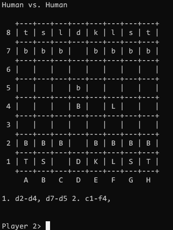
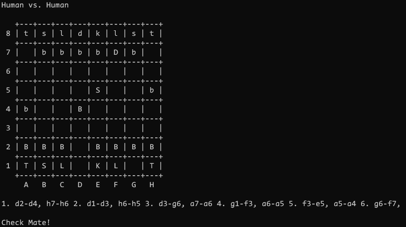

# Chess Game

Terminal chess game in c++

I wanted to do a project in c++ and created a terminal chess game. Some rules 
are not implemented but 1 vs. 1 is possible to play. 
There is also a computer player but it is not very well implemented. 




## Game Play

### Type of player

Enter type of player for player 1/2.

```
Player 1: Human or Computer (h/c) h
Player 2: Human or Computer (h/c) c
```

### Turn of each player

White is represented with the big letters and starts first. By entering the 
coordinates (with small letters) each player can make a turn.

```
Player 1> d2-d4
...
```

Each turn will be listed below the board.


### End of game

The game stops when someone achieves a check mate against the opponent or some 
player types `quit`. 

## Replay of a game

It is possible to pipe a chess play into the executable to replay a match. It 
can also be used to pause a game and start at the last point.

Here is an example of a simple play where white wins a dummy match. 
```
$ game < game.txt
```




## Computer 

It is possible to define one or both players as computer player. Since the 
computer player is not really well implemented (rather a test case) the game is 
not really advanced.

